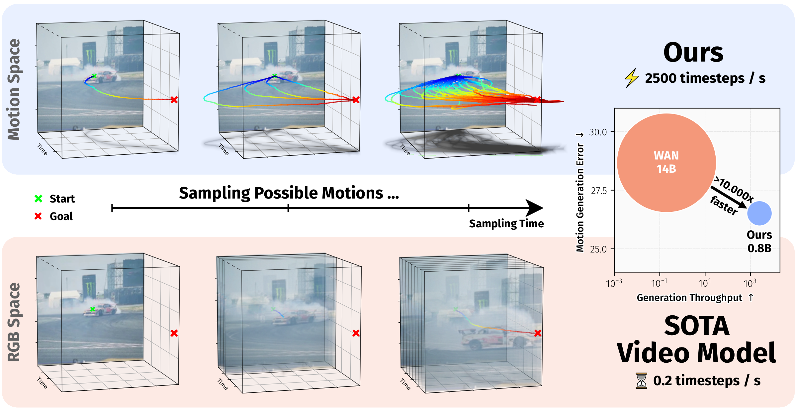
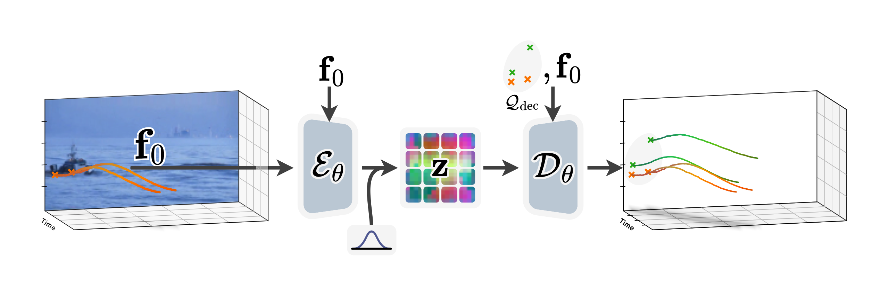
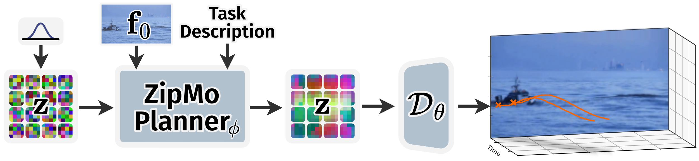
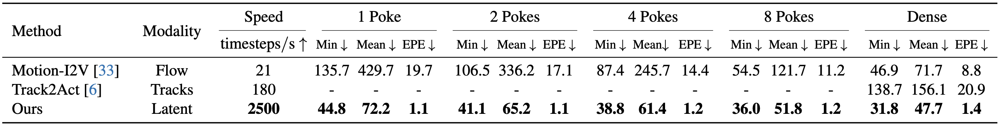
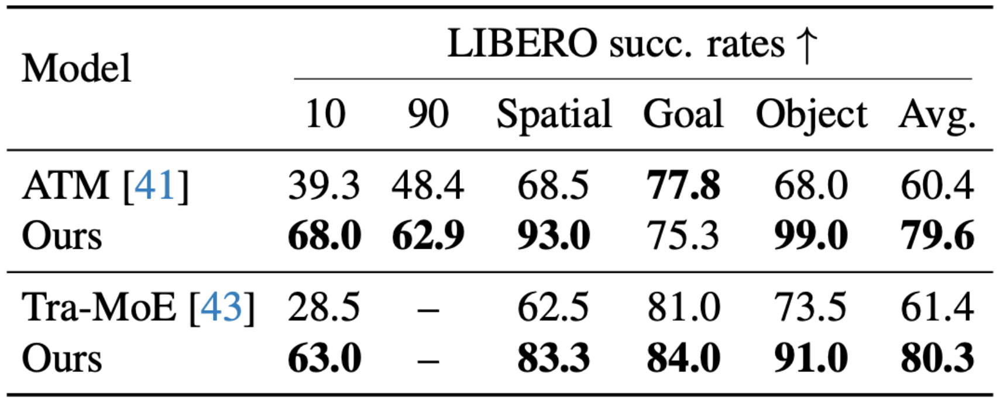

# Learning Long-term Motion Embeddings for Efficient Kinematics Generation

<!-- <h2 align="center">🚀 ZipMo: Efficient long-horizon kinematics generation in motion space</h2> -->

[](https://compvis.github.io/long-term-motion)
[](https://arxiv.org/)
[](https://huggingface.co/CompVis/ZipMo)
[](#citation)

<div align="center">
  <a href="https://nickstracke.dev" target="_blank">Nick Stracke</a><sup>*,1,2</sup> · 
  <a href="https://koljabauer.com" target="_blank">Kolja Bauer</a><sup>*,1,2</sup> · 
  <a href="https://stefan-baumann.eu" target="_blank">Stefan Andreas Baumann</a><sup>1,2</sup> ·
  Miguel Angel Bautista<sup>3</sup> ·
  Josh Susskind<sup>3</sup> ·
  <a href="https://ommer-lab.com" target="_blank">Bjorn Ommer</a><sup>1,2</sup>
</div>
<p align="center">
  <b><sup>1</sup>CompVis @ LMU Munich, <sup>2</sup>MCML, <sup>3</sup>Apple</b><br/>
  <sup>*</sup>Equal contribution / CVPR 2026
</p>

<p align="center">
  
</p>

Understanding and predicting motion is a fundamental component of visual intelligence. ZipMo models scene dynamics by operating directly on a long-term motion embedding learned from large-scale tracker trajectories. This motion-first representation avoids full video synthesis when the target is kinematics: it supports efficient generation of long, realistic motions that satisfy goals specified by text prompts or spatial pokes.

## ✨ Highlights

- We learn a compact long-term motion embedding from tracker-derived trajectories and start-frame context.
- The embedding reaches 64x temporal compression and still supports dense reconstruction at arbitrary spatial query points.
- Conditional flow matching in this learned motion space generates diverse, goal-conditioned trajectories from text or spatial pokes.
- On open-domain videos and LIBERO robotics benchmarks, the model improves motion quality and action prediction while being substantially more efficient than video-space generation.

## 🚀 Usage

There are three common ways to get started:

1. Launch the interactive demo to try poke-conditioned motion generation visually.
2. Use Torch Hub if you want pretrained modules directly in your own code.
3. Install the repository manually if you want to run the demo, evaluation scripts, or LIBERO rollouts locally.

### 🎮 Interactive Demo

From a local checkout with dependencies installed, launch the Gradio demo. If you still need to set up the environment, use the Manual Setup steps at the end of this section.

```bash
python -m scripts.demo --server_port 55555
```

The demo loads the sparse planner, lets you upload or choose a start frame, click spatial pokes, and sample multiple plausible motion futures. Compilation is optional, but useful for repeated inference:

```bash
python -m scripts.demo --server_port 55555 --compile True
```

### 🔥 Torch Hub

For programmatic use, the pretrained models are exposed through `hubconf.py`. Weights are downloaded automatically from [`CompVis/ZipMo`](https://huggingface.co/CompVis/ZipMo).

```python
import torch

repo = "kliyer-ai/track-ae-release"

planner_sparse = torch.hub.load(repo, "zipmo_planner_sparse")
planner_dense = torch.hub.load(repo, "zipmo_planner_dense")
vae = torch.hub.load(repo, "zipmo_vae")

# LIBERO planning and policy components.
libero_atm_planner = torch.hub.load(repo, "zipmo_planner_libero", "atm")
libero_tramoe_planner = torch.hub.load(repo, "zipmo_planner_libero", "tramoe")
policy_head_atm = torch.hub.load(repo, "zipmo_policy_head", "atm")
policy_head_tramoe_goal = torch.hub.load(repo, "zipmo_policy_head", "tramoe", "goal")
```

Available pretrained entries:

- `zipmo_planner_sparse`: sparse-poke planner for open-domain video evaluation.
- `zipmo_planner_dense`: dense-conditioning planner for open-domain video evaluation.
- `zipmo_planner_libero`: LIBERO planner, with `mode` set to `atm` or `tramoe`.
- `zipmo_policy_head`: LIBERO policy head, with `mode` set to `atm` or `tramoe`; Tra-MoE also needs a suite name from `10`, `goal`, `object`, or `spatial`.
- `zipmo_vae`: the motion autoencoder used by the planners.

### 🛠️ Manual Setup

Clone the repository and install the Python dependencies:

```bash
git clone https://github.com/kliyer-ai/track-ae-release.git
cd track-ae-release

conda create -n zipmo python=3.10 -y
conda activate zipmo
pip install -r requirements.txt
```

The default inference and evaluation paths assume a CUDA GPU and use `bfloat16`.

## 📊 Standard Evaluation

The standard open-domain evaluation has two stages:

1. Sample trajectories with [`scripts/sample.py`](scripts/sample.py).
2. Compute metrics with [`scripts/eval.py`](scripts/eval.py).

First download the evaluation targets and videos from the shared Google Drive folder:

https://drive.google.com/drive/folders/1ddt4gPIbfnvnARRjL1YdWYpGS0J3tASN

Place the files under `data/`. The sampler defaults to this layout:

```text
data/
  gt_tracks.pt
  pexels/
    original-<video_name>.mp4
    ...
```

If your downloaded folder uses a different layout, pass `--gt_path` and `--samples_path` explicitly.
For example, if the targets unpack into a `gt_data` folder, either place the target tensor at `data/gt_tracks.pt` or point `--gt_path` at the downloaded target file.

### 🧩 Sparse Mode

Sparse mode loads `zipmo_planner_sparse`, draws `K=8` samples per video, and evaluates the poke-conditioning settings `1`, `2`, `4`, `8`, and `16`. It also writes trajectory visualizations.

```bash
python -m scripts.sample --mode sparse

python -m scripts.eval \
  --results_path outputs/evals/sparse-cfg1.0-seed43/results.pt \
  --k 8
```

### 🧱 Dense Mode

Dense mode loads `zipmo_planner_dense`, conditions on all `40` target trajectories, and draws `K=128` samples. Visualization is disabled by default in this mode because the sample count is large.

```bash
python -m scripts.sample --mode dense

python -m scripts.eval \
  --results_path outputs/evals/dense-cfg1.0-seed43/results.pt \
  --k 128 # or 8
```

The evaluation prints per-model averages for `Min_MSE`, `Mean_MSE`, `MeanT_MSE`, endpoint error (`EPE`), and diversity statistics.

## 🤖 LIBERO Action Prediction

For LIBERO, ZipMo predicts task-conditioned object motion from a task description and start frame. A lightweight policy head maps the generated motions to 7D robot actions for rollout evaluation.

The LIBERO simulation stack is more fragile than the open-domain video evaluation. The following setup was used for this release and has been tested on NVIDIA A100 GPUs.

```bash
conda create -n libero_env python=3.10 -y
conda activate libero_env

# From the project root:
git clone https://github.com/Lifelong-Robot-Learning/LIBERO.git LIBERO
cd LIBERO
pip install -r requirements.txt
pip install -e .
python benchmark_scripts/download_libero_datasets.py --download-dir .
cd ..

pip install -r requirements_libero.txt
python scripts/preproc_text_emb.py --dataset-root LIBERO/datasets
```

Then run policy evaluation:

```bash
cd <PROJECT_ROOT>
accelerate launch ./scripts/eval_libero_policy.py \
  --save_path <OUTPUT_DIR> \
  --ckpt_path <POLICY_CKPT_PATH> \
  --suite <libero_goal|libero_object|libero_spatial|libero_10|libero_90>
```

Required arguments are `--save_path`, `--ckpt_path`, and `--suite`. Defaults assume LIBERO is checked out at `<PROJECT_ROOT>/LIBERO`, with datasets at `LIBERO/datasets` and text embeddings at `LIBERO/task_embedding_caches/task_emb_bert.npy`. If your layout differs, also set `--dataset_path`, `--task_emb_cache_path`, and `--libero_path`.

`--ckpt_path` should point to a local policy-head checkpoint. The released policy heads live in the Hugging Face weights repository under `policy_heads/`, including `atm_libero.safetensors`, `tramoe_libero_10.safetensors`, `tramoe_libero_goal.safetensors`, `tramoe_libero_object.safetensors`, and `tramoe_libero_spatial.safetensors`.

Useful additional options:

```bash
accelerate launch ./scripts/eval_libero_policy.py \
  --save_path outputs/libero_eval \
  --ckpt_path <POLICY_CKPT_PATH> \
  --suite libero_goal \
  --num_env_rollouts 10 \
  --vec_env_num 10 \
  --track_pred_nfe 10 \
  --cfg_scale 1.0 \
  --vis_tracks
```

The script prints a final success-rate summary and writes rollout videos under `<OUTPUT_DIR>/eval_results/`.

## 🗂️ Repository Layout

```text
zipmo/
  vae.py          # long-term motion autoencoder
  planner.py      # sparse, dense, and LIBERO planners
  policy_head.py  # LIBERO action head
  blocks.py       # transformer and attention building blocks
  dino.py         # image encoder utilities

scripts/
  demo.py                 # Gradio demo
  sample.py               # open-domain trajectory sampling
  eval.py                 # open-domain metric computation
  eval_libero_policy.py   # LIBERO rollout evaluation
  preproc_text_emb.py     # LIBERO task embedding preprocessing

docs/
  index.html       # project page
  static/          # figures, tables, and rollout videos

hubconf.py         # Torch Hub entry points
requirements.txt
requirements_libero.txt
```

## ⚙️ How It Works

ZipMo first learns a dense motion space by encoding sparse tracker trajectories and the start frame into a compact latent motion grid. The decoder can reconstruct dense trajectories at arbitrary query points.



It then trains a conditional flow-matching model in the learned motion space. At inference time, the planner samples a motion latent conditioned on scene context plus task information, such as spatial pokes or LIBERO task embeddings.



## 🏆 Results

On open-domain videos, ZipMo is evaluated from sparse poke conditioning to dense guidance. The model is designed to generate kinematics directly, so it can compare against both specialized trajectory predictors and video generation baselines whose videos are tracked afterward.



For LIBERO action prediction, the model follows the ATM and Tra-MoE evaluation protocols and rolls out a policy head on top of generated motion.



## 🎓 Citation

If you find this code or model useful, please cite:

```bibtex
@inproceedings{stracke2026motionembeddings,
  title     = {Learning Long-term Motion Embeddings for Efficient Kinematics Generation},
  author    = {Stracke, Nick and Bauer, Kolja and Baumann, Stefan Andreas and Bautista, Miguel Angel and Susskind, Josh and Ommer, Bj{\"o}rn},
  booktitle = {Proceedings of the IEEE/CVF Conference on Computer Vision and Pattern Recognition},
  year      = {2026}
}
```

## 🙏 Acknowledgements

This repository uses project-page assets from the academic project page in `docs/`. The implementation builds on PyTorch, Torch Hub, Hugging Face Hub, Gradio, and the LIBERO robotics benchmark.
